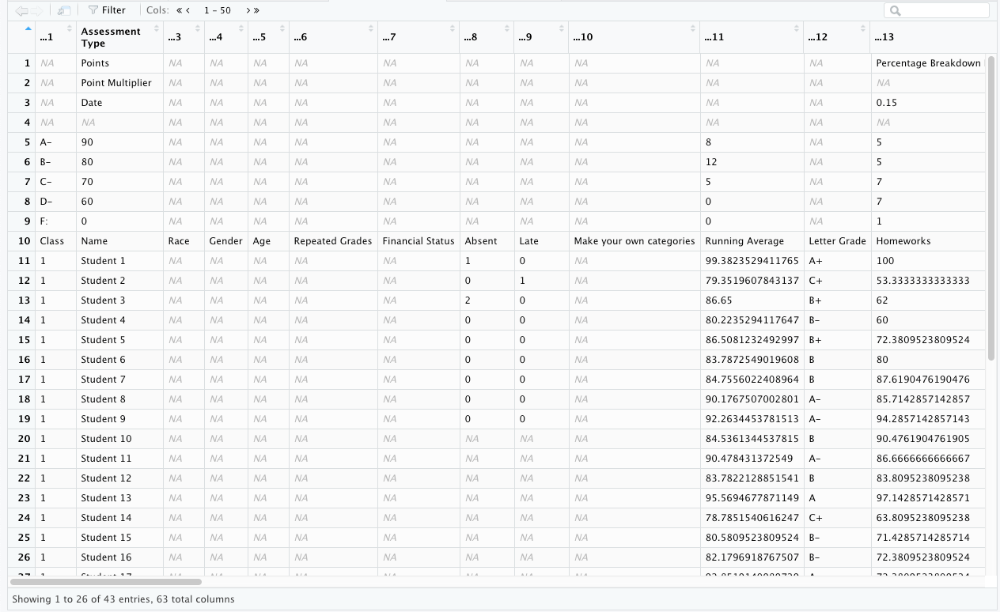
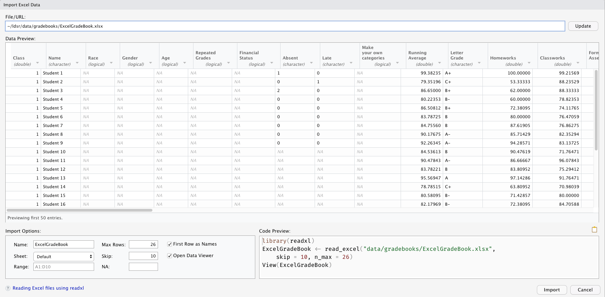
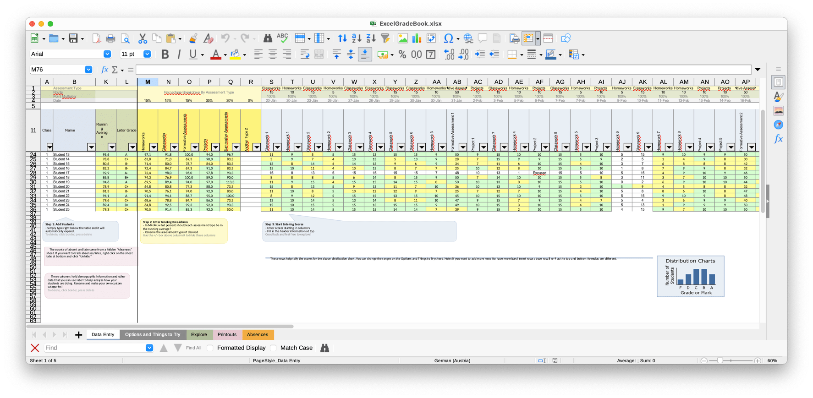

# Classroom Gradebook

## Introduction

Notes of this chapter references chapter 8 ([Walkthrough
2](https://datascienceineducation.com/c08.html): Approaching Gradebook
Data From a Data Science Perspective) of [Data Science in Education
Using R](https://datascienceineducation.com/).

The analysis centers around a common K-12 classroom tool: the gradebook.
Because this kind of data is on an individual student level this chapter
uses a simulated dataset. Data source is an Excel file named
`ExcelGradeBook.xlsx` generated from an Excel gradebook template,
[Assessment Types
Points](https://web.mit.edu/jabbott/www/excelgradetracker.html).

```{r setup}
# Load libraries
library(tidyverse)
library(here)
library(readxl)
library(janitor)
library(dataedu)
```

## Transfer file

Some steps to import data are in the book described differently and IMHO
not completely. The book assumes that you have downloaded the book
repository. I will focus just on the transfer of the file itself.

To transfer the file to your computer there are two options:

-   You could go manually to the location on the internet. The file is
    available at the [book
    repository](https://github.com/data-edu/data-science-in-education)
    inside the folder "gradebook" which itself is under the folder
    "data". You could go to the repo page
    (<https://github.com/data-edu/data-science-in-education/blob/master/data/gradebooks/ExcelGradeBook.xlsx>)
    and click on the "Download" button to save the file on your hard
    disc in the prepared RStudio project folder.
-   Our --- my preferred solution --- you could download the file
    directly via R. In this case we need to solve a general problem: How
    can you make sure that your colleagues are able to use your code?
    They have on their computers a different file organisation, so that
    using an absolute file path would not work. Even a relative path is
    dependent from the folder you are where you are going to start the
    procedure.

### Using `here()`

Providing file locations for loading or saving files is under the
reproducibility perspective a big challenge. It is also a general
problem so that it pays the effort to develop a special package just to
solve this problem. The general solution is implemented in the
**{rprojroot}** package. [rprojroot](https://rprojroot.r-lib.org/) helps
accessing files relative to the project root to [stop the working
directory
insanity](https://gist.github.com/jennybc/362f52446fe1ebc4c49f). Nut we
will use the **{here}** package, which is derived from **{rprojroot}**
but much simpler to use for our purpose.

The `here()` function from the **{here}** package uses a reasonable
heuristic to locate your file relative to the project root. This means
that you only have to add the file path from your working directory.
There are two modes to do this:

-   You write one complete expression like
    `here("some/path/below/your/project/root.txt")` or
-   you write every part separately like
    `here("some", "path", "below", "your", "project", "root.txt")`

I prefer the second option with a somewhat different layout, so that I
can see more clearly the directory hierarchy:

`here("some",        "path",        "below",        "your",              "project",        "root.txt"      )`

Before you can transfer the file to your computer you need to prepare a
place where you would like to store the file. I recommend to use the
same path hierarchy as in the book repository: Create a folder
`gradebook` inside of a folder `data` that itself lives at the top level
in your project directory.

You could create the folders manually either on the level of my
operation system or via the file pane of RStudio. The advantage is that
I do not have to learn and apply R commands for this procedure. The
disadvantage is that the code is not full reproducible. If you want
secure that your colleagues are working with exact the same environment
than you, than provide the necessary code, but commented out. Why
commented out? Nobody wants that a program changes something on the
private local hard disk without the explicit permission of the owner.

Now let's apply `here()` and transfer the file to your computer:

First of all we need to prepare the file path and create the folder
structure. We need to do this from a standard reference point, e.g.,
from the perspective of the project directory by using the `here()`
function.

To get the download URL we need to right-click at the "Download" button
at the location reported above and to copy the internet address into the
clipboard. To ease the handling of this long string we are going to
store it under the variable name `gradebook_url`. Then we will use the
`download.file()`, which is part of every R installation.

`download.file()` has several options, but we are going to use only the
two mandatory parameters: The URL where we will get the file and the
local path where we will store the transferred file. Again we will use
for the file path the `here()` function.

```{r transfer-file, eval=FALSE}
## comment out the next line if you want create the folder structure programmatically
# dir.create(here("data", "folder"), recursive = TRUE)

## store download link into a variable
gradebook_url <- 
    "https://github.com/data-edu/data-science-in-education/raw/master/data/gradebooks/ExcelGradeBook.xlsx"

## download and store the file
download.file(gradebook_url, here("data", 
                                  "gradebooks", 
                                  "ExcelGradeBook.xlsx"))
```

If you have succeeded, you should see the following text under the R chunk:

::: greybox
trying URL '<https://github.com/data-edu/data-science-in-><br>
education/raw/master/data/gradebooks/ExcelGradeBook.xlsx'<br> Content
type 'application/octet-stream' length 116083 bytes (113 KB)<br>
==================================================<br> downloaded 113
KB<br>
:::

To secure that you do not always download the same file when you run
your program code I recommend to comment out these lines. Or --- if you
are using RMarkdown like me --- write the option "eval=FALSE" in the
chunk header. (This was the reason that you could not see the original
message in the R chunk above so that I had to reproduce the message
myself.)

### Import file into R

You have now the Excel file `ExcelGradeBook.xlsx` on our local hard disk.
The next step is to import it into R.

The recommended file format for working with dataset in R is the `.csv`
(comma-separated-value) format: These files are plain text and not a
proprietary format. To import `.csv` or other tabular data (tsv =
tabulator separated files, fwf = fixed-width files or web log files) one
uses the **{readr}** package, which is part or the tidyverse.

Nowadays there is with **{vroom}** another implementation of delimited
and fixed data to R. [Vroom](https://vroom.r-lib.org/) is 25 times
faster than **{readr}**, has almost all the parsing feature of
**{readr}** and even other new features as well. Until today I haven't
seen many real life application with **{vroom}**: Either it is still too
early or there are other consideration I do not know to keep using
**{readr}**. One reason might that the speed advantages of **{vroom}**
count only with very big datasets. The performance benchmark test for
example was done with a 1.55 GB dataset. Following this assumption
**{readr}** is still the predominant file package for reading in
delimited and fixed data to R.

However, data won't always come in the preferred `.csv` file format.
This walkthrough imports an Excel file because these file types, with
the `.xlsx` or `.xls` extensions, are very likely to be encountered in
the K-12 education world.

The book code uses the `read_excel()` function of the **{readxl}**
package to read the data of the locally stored file
(`ExcelGradeBook.xlsx`). **{readxl}** is part of the tidyverse and
supplements **{readr}**, the main tidyverse program for data import. The
`read_excel()` functions determines if the format is the legacy `.xls`
or the modern xml-based `.xlsx` format. Because of the file extension we
know that `ExcelGradeBook.xlsx` is in `.xlsx` format, we could also use
the slightly faster `read_xlsx()`.

::: infobox
Use the **{readODS}** package for reading and writing OpenDocument
Spreedsheets (ODS files). ODS files are derived from the Open Document
Format (ODF), an OpenSource ISO-certifacted standard for office
applications.

OpenSource software like [LibreOffice](https://www.libreoffice.org/)
uses this standard. It is the OpenSource alternative for the proprietary
Microsoft file format.
:::

### Inspect file

One necessary step during the import procedure is to inspect the file. The
inspection is necessary to know about the structure of the dataset. There are at least
three possible ways to do this:

1.  Using R code --- as the book demonstrates --- to inspect the file.
2.  Using appropriate software to open the file and inspect it.
3.  Using RStudio interactive dataset importing tools under the menu
    "File" -> "Import dataset" -> "From Excel...".
    
For demonstrative purposes we are going to apply all three options.

#### Using R code

We will use for the local file path again here() and load "ExcelGradeBook.xlsx" into the R object `ExcelGradeBook`. As the book suggests we will make a copy with a better name (`gradebook`), that is easier to remember and type. We will later on work with this copy and have leave the original as a backup if anything goes wrong.

#### Standard printing

Then we display the content of `gradebook` to inspect its content.

```{r read-into-r}
# Use readxl package to read and import file and assign it a name
ExcelGradeBook <-
  read_excel(
    here("data", 
         "gradebooks", 
         "ExcelGradeBook.xlsx")
  )

# Copy R object to have a working file and a backup
gradebook <- ExcelGradeBook 
gradebook
```

Oops! What has happened here? If you inspect the content of the dataset
you will learn that

-   we've got a dataset with 43 columns and 63 rows
-   without sensible columns names (R has warned us that it created many columns automatically)
-   with 25 students under the heading of `Assessment Type`
-   with many NA rows at the beginning but also at the end of the
    dataset.

The reason for this strange structure is that someone has used the first
9 lines of the Excel file for a note about the grading system. As
important as this note may be, it runs counter the R assumption that the
first line will be a row with the column names.

#### Using `print()`

Unfortunately the standard printing procedure of R with tibble datasets
(a special sort of data frames in the `tidyverse`) limits the
presentation of exact 10 rows per page. Therefore it is especially
difficult to see what has happened. It would be better to see the whole
dataset at once. This could be done with the `print()` command by stating explicitly how many rows are to print.

```{r inspect-with-printing-options}
### print file with specifies row numbers: for instance
## print(gradebook, n = 100)


### or specify the number with the `nrow()` function
## print(gradebook, n = nrow(gradebook))

### the same code but with pipe operator
gradebook %>% print(n = nrow(.)) 
```
#### Using `paged_table()`

Another option to inspect the whole dataset with R is:

```{r inspect-with-paged-table}
gradebook %>% rmarkdown::paged_table()
```

#### RStudio file viewer

Finally you could also use RStudio intern file viewer at the console with `View(gradebook)` or programmatically with `view(gradebook)`. The following screenshot display the view via RStudio.

To display the screenshot I used the chunk header together with the `include_graphics()` function of the **{knitr}** package.

````md
```{r rstudio-screenshot-dataset, echo=FALSE, fig.cap='Screenshot of the dataset loaded with `View(ExcelGradeBook)` into RStudio', out.width='95%', fig.align='center', fig.alt='Screenshot of the dataset loaded with `View(ExcelGradeBook)` into RStudio showing that the dataset starts with line 10.', out.extra='class="shadow"'}`r ''`

```
````


```{r rstudio-screenshot-dataset, echo=FALSE, fig.cap='Screenshot of the dataset loaded with `View(ExcelGradeBook)` into RStudio', out.width='95%', fig.align='center', fig.alt='Screenshot of the dataset loaded with `View(ExcelGradeBook)` into RStudio showing that the dataset starts with line 10.', out.extra='class="shadow"'}

```

#### RStudio import dataset

Using the RStudio interface interactively is another very practical way of inspecting and importing data. In this case you need not to know the exact syntax of the R code. You also can see that there are several datasheets and can inspect their content. When RStudio is importing the dataset it will also write the code lines it has used into the console. You can copy it and use it in your script.


```{r rstudio-import-data-interface, echo=FALSE, fig.cap='Screenshot of the interactive interface of RStudio for importing datasets.', out.width='95%', fig.align='center', fig.alt='Screenshot of the interactive interface of RStudio for importing datasets.', out.extra='class="shadow"'}

```

#### Application software

But all these possibilities gives you not the full information. Why are there empty (NA) rows at the end of the dataset? This information you could only get by opening the file with the appropriate software tool. 

```{r libreoffice-screenshot-dataset, echo=FALSE, fig.cap='Screenshot of the dataset loaded into LibreOffice', out.width='95%', fig.align='center', fig.alt='Screenshot of the dataset loaded into LibreOffice, showing that the dataset starts with line 10 and that at the end is other for the data analysis not relevant information.', out.extra='class="shadow"'}

```

The screenshot shows that there other datasheets as well, but just the first one is relevant for us. We also get an explication why there are so many NA's rows after the dataset: We mentioned that we used a publicly available gradebook template. It happens that these templates have additional information on their first datasheet how to use the template.

#### Conclusion

The gist of our extensive inspection: 

- Skip the first 10 lines
- Read 26 line into R (25 student and the column headings)
- Use just the first sheet

```{r read-into-r-v2}
# Use readxl package to read and import file and assign it a name
ExcelGradeBook <-
  read_xlsx(
    here("data", 
         "gradebooks", 
         "ExcelGradeBook.xlsx"),
    sheet = 1,
    skip = 10,
    n_max = 26
  )

# Copy R object to have a working file and a backup
gradebook <- ExcelGradeBook 
gradebook
```


::: {.infobox}
If you have appropriate software (and you know how to use it), then inspect the file as the very first step. It is the easiest way to get the full information about the file to import.
:::
