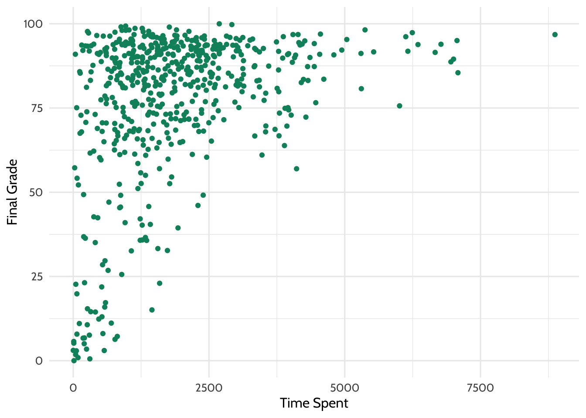
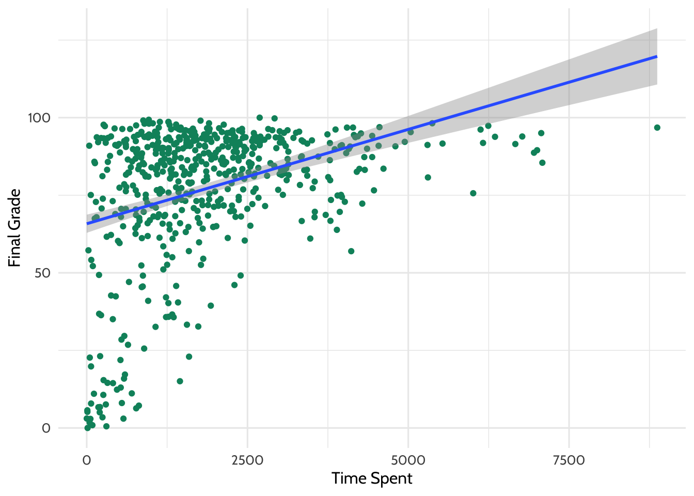

# Online Science Class Data

## Introduction

Notes of this chapter references chapter 7 ([Walkthrough 1](https://datascienceineducation.com/c07.html): The Education Data Science Pipeline With Online Science Class Data) of [Data Science in Education Using R](https://datascienceineducation.com/).

The chapter focuses on processing data to prepare the information for data analysis. At the finish of this chapter there is also an analysis (regression model), but the main point of this walkthrough is data wrangling. The following list presents only those functions where I have learning something new:

- apply a function across multiple columns using `across()`, explaining purrr style formulas, and procedures to convert old `(mutate)_if`, `_at`, and `_all` code
- create columns from scale values and reversing scales using `case_when()`
- convert from wide to long format using `pivot_longer()`
- separate data from one column into different columns using `separate()`
- join dataset using different kinds of joins (`left_join()`, `semi_join()`, `anti_join()`, `right_join()`)
- select distinct/unique rows using `distinct()`
- generate table output `tab_model()` from the {sjPlot} package
- save tables in Word format using functions from the {apaTables} package

## Setup

Load all packages used for this chapter.


```r
# Data Science in Education
# Packages for Walkthrough 1 

library(tidyverse)
#> ── Attaching packages ───────────────────────────── tidyverse 1.3.1 ──
#> ✓ ggplot2 3.3.5     ✓ purrr   0.3.4
#> ✓ tibble  3.1.6     ✓ dplyr   1.0.7
#> ✓ tidyr   1.1.4     ✓ stringr 1.4.0
#> ✓ readr   2.1.1     ✓ forcats 0.5.1
#> ── Conflicts ──────────────────────────────── tidyverse_conflicts() ──
#> x dplyr::filter() masks stats::filter()
#> x dplyr::lag()    masks stats::lag()
library(apaTables)
library(sjPlot)
#> Install package "strengejacke" from GitHub (`devtools::install_github("strengejacke/strengejacke")`) to load all sj-packages at once!
library(readxl)
library(dataedu)
```

## Process Survey

### Inspect Data


```r
# Pre-survey for the F15 and S16 semesters
pre_survey <- dataedu::pre_survey
glimpse(pre_survey)
#> Rows: 1,102
#> Columns: 12
#> $ opdata_username      <chr> "_80624_1", "_80623_1", "_82588_1", "_8…
#> $ opdata_CourseID      <chr> "FrScA-S116-01", "BioA-S116-01", "OcnA-…
#> $ Q1MaincellgroupRow1  <dbl> 4, 4, NA, 4, NA, 4, NA, 5, NA, 4, 4, 5,…
#> $ Q1MaincellgroupRow2  <dbl> 4, 4, NA, 3, NA, 2, NA, 3, NA, 4, 4, 4,…
#> $ Q1MaincellgroupRow3  <dbl> 4, 3, NA, 3, NA, 2, NA, 3, NA, 3, 3, 3,…
#> $ Q1MaincellgroupRow4  <dbl> 1, 2, NA, 2, NA, 2, NA, 1, NA, 2, 1, 1,…
#> $ Q1MaincellgroupRow5  <dbl> 5, 4, NA, 3, NA, 4, NA, 5, NA, 4, 5, 5,…
#> $ Q1MaincellgroupRow6  <dbl> 4, 4, NA, 3, NA, 4, NA, 4, NA, 4, 5, 5,…
#> $ Q1MaincellgroupRow7  <dbl> 1, 2, NA, 3, NA, 1, NA, 1, NA, 2, 2, 1,…
#> $ Q1MaincellgroupRow8  <dbl> 5, 3, NA, 4, NA, 4, NA, 5, NA, 4, 4, 5,…
#> $ Q1MaincellgroupRow9  <dbl> 5, 4, NA, 2, NA, 4, NA, 3, NA, 3, 3, 4,…
#> $ Q1MaincellgroupRow10 <dbl> 5, 2, NA, 4, NA, 4, NA, 4, NA, 3, 5, 4,…
```

This data source is a self-report survey. Data was collected
before the start of the course. The survey included ten items, each
corresponding to one of three motivation *measures*: interest, utility
value, and perceived competence. A *measure* is a concept that we try to
make concrete and assess using survey questions. The three motivation
measures we explore here come from Expectancy-Value Theory, which states
that students are motivated to learn when they both believe that they
can achieve something (expectancy, also known as "perceived competence")
and believe that the concept they are trying to learn is important
(value) ([Wigfield & Eccles,
2000](https://datascienceineducation.com/references.html#ref-wigfield2000)).

There are multiple types of value, but we explore two of them here:
interest and utility value. Utility value is the degree to which a
person is able to connect the concept being learned with something they
will utilize in their future life. This survey included the following
ten items:

1.  I think this course is an interesting subject. (Interest)
2.  What I am learning in this class is relevant to my life. (Utility
    value)
3.  I consider this topic to be one of my best subjects. (Perceived
    competence)
4.  I am not interested in this course. (Interest---reverse coded)
5.  I think I will like learning about this topic. (Interest)
6.  I think what we are studying in this course is useful for me to
    know. (Utility value)
7.  I don't feel comfortable when it comes to answering questions in
    this area. (Perceived competence--reverse coded)
8.  I think this subject is interesting. (Interest)
9.  I find the content of this course to be personally meaningful.
    (Utility value)
10. I've always wanted to learn more about this subject. (Interest)


We will process the self-report items into three scales for 

1) interest, 
2) perceived competence, and
3) utility value. 

We do this by:

- Renaming the question variables to something more manageable
- Reversing the response scales on questions 4 and 7
- Categorizing each question into a measure
- Computing the mean of each measure

### Rename variables


```r
pre_survey  <-
  pre_survey  %>%
  # Rename the questions something easier to work with 
  # because R is case sensitive
  # and working with variable names in mix case is prone to error
  rename(
    q1 = Q1MaincellgroupRow1,
    q2 = Q1MaincellgroupRow2,
    q3 = Q1MaincellgroupRow3,
    q4 = Q1MaincellgroupRow4,
    q5 = Q1MaincellgroupRow5,
    q6 = Q1MaincellgroupRow6,
    q7 = Q1MaincellgroupRow7,
    q8 = Q1MaincellgroupRow8,
    q9 = Q1MaincellgroupRow9,
    q10 = Q1MaincellgroupRow10
  ) %>%
  
  ## CONVERT ALL QUESTION RESPONSES TO NUMERIC 
  
  ## a) The code line of the book
  ## ~ (tilde) is an alternative for an anonymous function
  ## . (dot) represents the (selected) columns
  # mutate_at(vars(q1:q10), list( ~ as.numeric(.))) ## WORKS!
  
  
  ## Above line could be written without abbreviations
  ## for more information see section on "Purr style formula"
  #  mutate_at(vars(q1:q10), list( function(x) as.numeric(x))) ## WORKS!
  
  ## b) mutate_at is # superseded by the use of across() in an existing verb
  ## there are different options to apply across() using different selectors

  ## b1)
  # mutate(across(num_range(prefix = "q", range = 1:10)), list( ~ as.numeric(.))) ## WORKS!

  ## b2)
  # mutate(across(starts_with("q"), list( ~ as.numeric(.)))) ## WORKS!

  ## b3)
  ## mutate(across(q1:q10, list( ~ as.numeric(.)))) ## WORKS!

  ## c) as across applies only to selected columns 
  ## it is not necessary to list all data frame columns
  ## instead of using the above formula coding style
  ## one could write the much simpler code line

  mutate(across(q1:q10, as.numeric)) ## WORKS!

  ## d) this means that even the original book line could be simplified
     # mutate_at(vars(q1:q10), as.numeric) ## WORKS!
```


The last line of this code chunk is of special interest for me. The book used `mutate_at(vars(q1:q10), list( ~ as.numeric(.)))`, which is problematic for two reasons:

- `mutate_at` is "superseded by the use of `across()`" (from the help file). This also means that the `vars` function is also outdated as it was only needed for the scoped verbs (`_if`, `_at`, `_all`).
- `list( ~ as.numeric(.))` is pretty cryptic, especially for beginners. What does `~` (tilde) and `.` (dot) in this line mean?

#### Introducing `across()`

The [column-wise operations](https://dplyr.tidyverse.org/articles/colwise.html) vignette states under the header "Basic usage" that there are two primary arguments:

> - The first argument, `.cols`, selects the columns you want to operate on. It uses tidy selection (like [select()](https://dplyr.tidyverse.org/reference/select.html)) so you can pick variables by position, name, and type.
> - The second argument, `.fns`, is a function or list of functions to apply to each column. This can also be a purrr style formula (or list of formulas) like `~ .x / 2`. 

This explanation needs some understanding otherwise it creates just more questions:

- What is tidy selection?
- What is a purrr style formula?

##### Tidy selection

**Tidy selection** is a kind of mini language or R dialect to provide functions to select variables based on their names or properties. The [selection language reference](https://dplyr.tidyverse.org/reference/dplyr_tidy_select.html) provides a list of these modifiers and selection helpers. But it is important to know that these types of arguments **only work in a selection context**, e.g. in functions like `dplyr::select()` or `tidyr::pivot_longer()`. Using a selection helper anywhere else results in the error message: "Error: <helper function name> must be used within a *selecting* function. i See <https://tidyselect.r-lib.org/reference/faq-selection-context.html>". 

Here is an example of the error message:


```r
starts_with("q")
```

> Error: `starts_with()` must be used within a *selecting* function.<br>
> ℹ See <https://tidyselect.r-lib.org/reference/faq-selection-context.html>.<br>
> Run `rlang::last_error()` to see where the error occurred.

##### Purrr style formula

[Purrr](https://purrr.tidyverse.org/) is a program package of the tidyverse containing tools for functional programming. As one important feature it includes a series of map-functions for iterations (loops). Another characteristic is that you can use it with vectors, functions and **formulae**. To tell R that you are using a formula (and not a variable) you have to use the tilde symbol `~`. There are three ways to refer to its arguments, allowing to create compact anonymous functions.

> - For a single argument function, use `.`
> - For a two argument function, use `.x` and `.y`
> - For more arguments, use `..1`, `..2`, `..3` etc.

In the book example is the tilde used as an anonymous function. This ca be seen when you replace the book code `list( ~ as.numeric(.))` with `list( function(x) as.numeric(x))`. This works as well as it is the same code only spelled out. (The `list()` function is necessary as the columns of the dataframe are returned as a list.)

#### Advantages of `across()`

The [column-wise operations](https://dplyr.tidyverse.org/articles/colwise.html) vignette mentions four advantages of `across()`:

1. `across()` applies a function (or functions) across multiple columns.
2. `across()` reduces the number of functions that `dplyr` needs to provide.
3. `across()` unifies `_if` and `_at` semantics so that you can select by position, name, and type in one line.
4. `across()` doesn’t need to use `vars()`.

#### Convert old code

The [column-wise operations](https://dplyr.tidyverse.org/articles/colwise.html) vignette also gives some hints how to convert old code. It boils down to three rules:

1. Strip the `_if()`, `_at()` and `_all()` suffix off the function. For examle: Instead of `mutate_at(vars(q1:q10), list( ~ as.numeric(.)))` after stripping the `_at` we got the code line `mutate(vars(q1:q10), list( ~ as.numeric(.)))`.
2. Call across(). The first argument will be:
  - For _if(), the old second argument wrapped in where().
  - For _at(), the old second argument, with the call to vars() removed.
  - For _all(), everything().
  In our case we have to change `mutate(vars(q1:q10), list( ~ as.numeric(.)))` two fold: Inserting the across() call and deleting the `vars()` part. Both steps are fulfilled in replacing `vars` with `across` so that we get:  `mutate(across(q1:q10), list( ~ as.numeric(.))))`
3. Additionally we could simplify the second part of the code line. Instead of using the more complex formula notation we can write `mutate(across(q1:q10), as.numeric)`

::: {.rmdimportant}
I am planning to write a PR for the [GitHub repo](https://github.com/data-edu/data-science-in-education) with

- several typos and to propose to
- change `mutate_at()` to `across()`: 

It is not only the code, one must also change the explaining book text!
:::

### Reverse scale

The scale of the survey responses on questions 4 and 7 must be reversed so the responses for all questions can be interpreted in the same way. As this is a common problem writing a function pays the effort.

Here the `case_when()` function is useful because it vectorises multiple `if_else()` statements. The argument is sequence of a two-sided formula. The left hand side (LHS) determines which values match this case and must evaluate to a logical vector return either TRUE or FALSE. The right hand side (RHS) provides the replacement value.


```r
# This part of the code is where we write the function:
# Function for reversing scales 
reverse_scale <- function(question) {
  # Reverses the response scales for consistency
  #   Arguments:
  #     question - survey question
  #   Returns: 
  #    a numeric converted response
  # Note: even though 3 is not transformed, case_when expects a match for all
  # possible conditions, so it's best practice to label each possible input
  # and use TRUE ~ as the final statement returning NA for unexpected inputs
  x <- case_when(
    question == 1 ~ 5,
    question == 2 ~ 4,
    question == 3 ~ 3, 
    question == 4 ~ 2,
    question == 5 ~ 1,
    TRUE ~ NA_real_
  )
  x
}

# And here's where we use that function to reverse the scales
# We use the pipe operator %>% here
# Reverse scale for questions 4 and 7
pre_survey <-
  pre_survey %>%
  mutate(q4 = reverse_scale(q4),
         q7 = reverse_scale(q7))
```

::: {.rmdnote}
It would be an interesting exercise to write a more general function:
- working for likert scales with 5 and 7 levels
- working for likert scales with a "forced option", where the neutral option is removed. (See [Wikipedia on Likert scales](https://en.wikipedia.org/wiki/Likert_scale))
:::

### From wide to long format

To calculate --- but also for visualizations --- we need all answers of the same person in one column. This means to transform the pre_survey dataset from wide format to long format. Instead of having 1,102 observations of 12 variables, we will get 11,020 observations of 4 variables.

Collecting all questions and answers under their respective headings we need to invent two names for the new columns. Appropriate names for the variables are `question` and `response`.

To add in the future new variables to the dataset we will create a new object `measure mean`.


```r
# Pivot the dataset from wide to long format
measure_mean <-
  pre_survey %>%
  # Gather questions and responses
  pivot_longer(cols = q1:q10,
               names_to = "question",
               values_to = "response")

measure_mean
#> # A tibble: 11,020 × 4
#>    opdata_username opdata_CourseID question response
#>    <chr>           <chr>           <chr>       <dbl>
#>  1 _80624_1        FrScA-S116-01   q1              4
#>  2 _80624_1        FrScA-S116-01   q2              4
#>  3 _80624_1        FrScA-S116-01   q3              4
#>  4 _80624_1        FrScA-S116-01   q4              5
#>  5 _80624_1        FrScA-S116-01   q5              5
#>  6 _80624_1        FrScA-S116-01   q6              4
#>  7 _80624_1        FrScA-S116-01   q7              5
#>  8 _80624_1        FrScA-S116-01   q8              5
#>  9 _80624_1        FrScA-S116-01   q9              5
#> 10 _80624_1        FrScA-S116-01   q10             5
#> # … with 11,010 more rows
```

### Create measure column

Next, we’ll take our new measure_mean dataset and create a column called `measure`. We’ll fill that column with one of three question categories:

- int: interest
- uv: utility value
- pc: perceived competence

We will again use the `case_when()` function. We ended up with one variable containing all possible question numbers (q1, q2, etc.). We will supply `case_when()` with a list of all the question numbers that correspond to each category: interest, utility value, and perceived competence. 

- **interest**: In the code below, we tell R to use questions 1, 4, 5, 8, and 10 to create the category `int`. 
- **utility value**: We then tell R to use questions 2, 6, and 9 to calculate `uv`. 
- **perceived competence**: We use the remaining questions 3 and 7 to calculate `pc`.

To collect all values into a vector we use the function `c()` for "combine".

We’ll introduce a new operator in order to do this: `%in!%`. Practically, this operator means that R should look within a list for something.


```r
# Add measure variable 
measure_mean_1 <- measure_mean %>% 
  # Here's where we make the column of question categories called "measure"
  mutate(
    measure = case_when(
      question %in% c("q1", "q4", "q5", "q8", "q10") ~ "int",
      question %in% c("q2", "q6", "q9") ~ "uv",
      question %in% c("q3", "q7") ~ "pc",
      TRUE ~ NA_character_)
  )

measure_mean_1
#> # A tibble: 11,020 × 5
#>    opdata_username opdata_CourseID question response measure
#>    <chr>           <chr>           <chr>       <dbl> <chr>  
#>  1 _80624_1        FrScA-S116-01   q1              4 int    
#>  2 _80624_1        FrScA-S116-01   q2              4 uv     
#>  3 _80624_1        FrScA-S116-01   q3              4 pc     
#>  4 _80624_1        FrScA-S116-01   q4              5 int    
#>  5 _80624_1        FrScA-S116-01   q5              5 int    
#>  6 _80624_1        FrScA-S116-01   q6              4 uv     
#>  7 _80624_1        FrScA-S116-01   q7              5 pc     
#>  8 _80624_1        FrScA-S116-01   q8              5 int    
#>  9 _80624_1        FrScA-S116-01   q9              5 uv     
#> 10 _80624_1        FrScA-S116-01   q10             5 int    
#> # … with 11,010 more rows
```

### Add measure variable

Finally we will create a new variable called `mean_response` that holds the means of our three categories `int`, `uv`, and `pc`. Since we are calculating the mean by category, we will need to first group the responses together using a function called `group_by()`. This function takes the data frame (or tibble) and converts it into a grouped tbl where operations are performed "by group". 

If you want to go back to the original tibble, use `ungroup()` to remove the grouping.

Next, we’ll use the function `summarize()` to create two new variables:  `mean_response` and `percent_NA`. 

`summarize()` (or `summarise()`) creates a new data frame. It will have one (or more) rows for each combination of grouping variables; if there are no grouping variables, the output will have a single row summarizing all observations in the input. It will contain one column for each grouping variable and one column for each of the summary statistics that you have specified.

We’ll find the mean response of each category using the `mean()` function. It is important to calculate the value without empty values (NA or not available values). With the argument `na.rm = TRUE` R calculates the mean after removing the NA values. (`na.rm` stands for "remove all NAs"). 

To detect if a cell or column contains NA's one has to use the function `is.na()`. Other test like `if response == NA` or `if response == "NA"` does not work!


```r
# Add measure variable 
measure_mean_2 <- measure_mean_1 %>%
  # First, we group by the new variable "measure"
  group_by(measure) %>%
  # Here's where we compute the mean of the responses
  summarize(
    # Creating a new variable to indicate the mean response for each measure
    mean_response = mean(response, na.rm = TRUE),
    # Creating a new variable to indicate the percent of each measure that 
    # had NAs in the response field
    percent_NA = mean(is.na(response))
    )

measure_mean_2
#> # A tibble: 3 × 3
#>   measure mean_response percent_NA
#>   <chr>           <dbl>      <dbl>
#> 1 int              4.25      0.178
#> 2 pc               3.65      0.178
#> 3 uv               3.74      0.178
```
## Process course cata

### Inspect data


```r
# Gradebook and log-trace data for F15 and S16 semesters
course_data <- dataedu::course_data

glimpse(course_data)
#> Rows: 29,711
#> Columns: 8
#> $ CourseSectionOrigID <chr> "AnPhA-S116-01", "AnPhA-S116-01", "AnPhA…
#> $ Bb_UserPK           <dbl> 60186, 60186, 60186, 60186, 60186, 60186…
#> $ Gradebook_Item      <chr> "POINTS EARNED & TOTAL COURSE POINTS", "…
#> $ Grade_Category      <chr> NA, NA, NA, "Hw", "Hw", "Qz", "Qz", "Hw"…
#> $ FinalGradeCEMS      <dbl> 86.272, 86.272, 86.272, 86.272, 86.272, …
#> $ Points_Possible     <dbl> 5, 30, 105, 140, 5, 5, 20, 50, 10, 50, 5…
#> $ Points_Earned       <dbl> 4.050, 24.000, 71.675, 140.970, 5.000, 4…
#> $ Gender              <chr> "F", "F", "F", "F", "M", "F", "F", "F", …
```

There are many gradebook items per course and student generated by the learning management system. 

The column `CourseSectionOrigID` combines information about course subject, semester, and section. This is not a tidy format where each variable has its own column. Only if every different type of information hat its own column we can use efficiently these data.

### Separate data

We therefore have to separate these kinds of information by using the function  `separate()`. Below, we will load course_data and run the `separate()` function to split up the subject, semester, and section so we can use them later on. We will keep for further reference the original column.


```r
# split course section into components
course_data <- 
  course_data %>%
  # Give course subject, semester, and section their own columns
  separate(
    col = CourseSectionOrigID,
    into = c("subject", "semester", "section"),
    sep = "-",
    remove = FALSE
  )
```

### Join data

The pre_survey and course_data datasets are referring to the same courses. `Opdata_courseID` (pre_survey dataset) and `CourseSectionOrigID` (course_data dataset) have the same identifiers. To join both datasets we need a column with the same name and same values (**keys**) in both tibbles. Instead to rename just one of these columns we take the occasion and clean up the name of both. One variable will correspond to the course, and the other will correspond to the student.

#### Create keys

We will rename `opdata_username` and `opdata_CourseID` to be `student_id` and `course_id`, respectively. (In the book there is in the text mentioned with `RespondentID` a wrong column name. But the code is correct.)


```r
pre_survey <-
  pre_survey %>%
  rename(student_id = opdata_username,
         course_id = opdata_CourseID)

pre_survey
#> # A tibble: 1,102 × 12
#>    student_id course_id        q1    q2    q3    q4    q5    q6    q7
#>    <chr>      <chr>         <dbl> <dbl> <dbl> <dbl> <dbl> <dbl> <dbl>
#>  1 _80624_1   FrScA-S116-01     4     4     4     5     5     4     5
#>  2 _80623_1   BioA-S116-01      4     4     3     4     4     4     4
#>  3 _82588_1   OcnA-S116-03     NA    NA    NA    NA    NA    NA    NA
#>  4 _80623_1   AnPhA-S116-01     4     3     3     4     3     3     3
#>  5 _80624_1   AnPhA-S116-01    NA    NA    NA    NA    NA    NA    NA
#>  6 _80624_1   AnPhA-S116-02     4     2     2     4     4     4     5
#>  7 _80624_1   AnPhA-T116-01    NA    NA    NA    NA    NA    NA    NA
#>  8 _80624_1   BioA-S116-01      5     3     3     5     5     4     5
#>  9 _80624_1   BioA-T116-01     NA    NA    NA    NA    NA    NA    NA
#> 10 _80624_1   PhysA-S116-01     4     4     3     4     4     4     4
#> # … with 1,092 more rows, and 3 more variables: q8 <dbl>, q9 <dbl>,
#> #   q10 <dbl>
```


```r
course_data <-
  course_data %>%
  rename(student_id = Bb_UserPK,
         course_id = CourseSectionOrigID)

course_data
#> # A tibble: 29,711 × 11
#>    course_id     subject semester section student_id Gradebook_Item   
#>    <chr>         <chr>   <chr>    <chr>        <dbl> <chr>            
#>  1 AnPhA-S116-01 AnPhA   S116     01           60186 POINTS EARNED & …
#>  2 AnPhA-S116-01 AnPhA   S116     01           60186 WORK ATTEMPTED   
#>  3 AnPhA-S116-01 AnPhA   S116     01           60186 0.1: Message You…
#>  4 AnPhA-S116-01 AnPhA   S116     01           60186 0.2: Intro Assig…
#>  5 AnPhA-S116-01 AnPhA   S116     01           60186 0.3: Intro Assig…
#>  6 AnPhA-S116-01 AnPhA   S116     01           60186 1.1: Quiz        
#>  7 AnPhA-S116-01 AnPhA   S116     01           60186 1.2: Quiz        
#>  8 AnPhA-S116-01 AnPhA   S116     01           60186 1.3: Create a Li…
#>  9 AnPhA-S116-01 AnPhA   S116     01           60186 1.3: Create a Li…
#> 10 AnPhA-S116-01 AnPhA   S116     01           60186 1.4: Negative Fe…
#> # … with 29,701 more rows, and 5 more variables:
#> #   Grade_Category <chr>, FinalGradeCEMS <dbl>,
#> #   Points_Possible <dbl>, Points_Earned <dbl>, Gender <chr>
```
#### Subtract data

We have now with `course_id` and `student_id` better  variable names as before. But by inspecting the resulting data we see that there is still another problem: For whatever reason the `pre_survey` has `_80624_1` as `student_id` instead just the five characters between the underscores (e.g., `80624`). So we need to extract respectively  subtract these five characters between the underscore (_) symbols.

::: {.rmdcaution}
Student IDs are character strings even if they consists of numbers. Why? It doesn't make sense to use them for calculations. Quite the contrary! It would be an error with fatal consequences to use it as a number. To prevent this mistake it is a measure of precaution to change their data type to character (or factor).

The book goes the other direction: In order to match both variable types it converts the character strings to a numbers. I would recommend the reverse procedure: To convert the number type of `student_id` in `course_data` into a character type.
:::

To extract the five characters between the underscore we are going to use the function `str_sub()` form the {stringr} package, another package from the {tidyverse}. The syntax is the following one:

`str_sub(string, start = 1L, end = -1L)`

> `start` gives the position of the first character (defaults to first), `end` gives the position of the last (defaults to last character). Negative values count backwards from the last character.


```r
# Re-create the variable "student_id" so that it excludes the extraneous characters
pre_survey <- pre_survey %>% 
  mutate(student_id = str_sub(student_id, start = 2, end = -3))

# Save "student_id" as a character string so that it matches with `pre_survey` 
course_data <-  course_data |> 
  mutate(student_id = as.character(student_id))
```


#### `left_join()`


```r
dat <-
  left_join(course_data, pre_survey,
            by = c("student_id", "course_id"))
dat
#> # A tibble: 40,348 × 21
#>    course_id     subject semester section student_id Gradebook_Item   
#>    <chr>         <chr>   <chr>    <chr>   <chr>      <chr>            
#>  1 AnPhA-S116-01 AnPhA   S116     01      60186      POINTS EARNED & …
#>  2 AnPhA-S116-01 AnPhA   S116     01      60186      WORK ATTEMPTED   
#>  3 AnPhA-S116-01 AnPhA   S116     01      60186      0.1: Message You…
#>  4 AnPhA-S116-01 AnPhA   S116     01      60186      0.2: Intro Assig…
#>  5 AnPhA-S116-01 AnPhA   S116     01      60186      0.3: Intro Assig…
#>  6 AnPhA-S116-01 AnPhA   S116     01      60186      1.1: Quiz        
#>  7 AnPhA-S116-01 AnPhA   S116     01      60186      1.2: Quiz        
#>  8 AnPhA-S116-01 AnPhA   S116     01      60186      1.3: Create a Li…
#>  9 AnPhA-S116-01 AnPhA   S116     01      60186      1.3: Create a Li…
#> 10 AnPhA-S116-01 AnPhA   S116     01      60186      1.4: Negative Fe…
#> # … with 40,338 more rows, and 15 more variables:
#> #   Grade_Category <chr>, FinalGradeCEMS <dbl>,
#> #   Points_Possible <dbl>, Points_Earned <dbl>, Gender <chr>,
#> #   q1 <dbl>, q2 <dbl>, q3 <dbl>, q4 <dbl>, q5 <dbl>, q6 <dbl>,
#> #   q7 <dbl>, q8 <dbl>, q9 <dbl>, q10 <dbl>
```
This is a surprising result for me. course_data has 29711 and pre_survey has 1102 observation. So I thought the left join would result in maximal 29711 + 1102 = 30813 row.But we have about 10000 more row. Why is this the case?

I think it has something to do that there is not just one unique identifier. The code applies two keys column for the join and both datasets have many duplicates in both key columns. 

To check my assumption is very difficult with these enormous datasets. I would need toy datasets to check my hunch.


```r
# Dataset of students
df1 <- tibble(
  subject = c("X", "X", "a", "a", "a", "a", "b", "b", "b", "b", "b", "b", "c", "c"),
  student = c(1,2,3,4,5,6,1,2,3,4,5,7,1,8),
  grade_SS = c(3,2,1,4,5,1,2,2,3,3,1,5,2,2)
)

df2 <- tibble(
  subject = c("a", "a", "a", "a", "b", "b", "b", "b", "c", "c"),
  student = c(3,4,5,6,3,4,5,6,1,2),
  grade_WS = c(1,4,5,1,3,3,1,5,3,3)
)

df_left <-
  left_join(df1, df2,
            by = c("subject", "student"))
df_left
#> # A tibble: 14 × 4
#>    subject student grade_SS grade_WS
#>    <chr>     <dbl>    <dbl>    <dbl>
#>  1 X             1        3       NA
#>  2 X             2        2       NA
#>  3 a             3        1        1
#>  4 a             4        4        4
#>  5 a             5        5        5
#>  6 a             6        1        1
#>  7 b             1        2       NA
#>  8 b             2        2       NA
#>  9 b             3        3        3
#> 10 b             4        3        3
#> 11 b             5        1        1
#> 12 b             7        5       NA
#> 13 c             1        2        3
#> 14 c             8        2       NA
```


#### `semi_join()`

`semi_join()` joins and retains all of the matching rows in the “left” and “right” data frame. This is useful when you are only interested in keeping the rows (or cases/observations) that are able to be joined. `semi_join()` will not create duplicate rows of the left data frame, even when it finds multiple matches on the right data frame. It will also keep only the columns from the left data frame.

For example, the following returns only the rows that are present in both course_data and pre_survey:


```r
dat_semi <- 
  semi_join(course_data,
            pre_survey,
            by = c("student_id", "course_id"))

dat_semi
#> # A tibble: 28,655 × 11
#>    course_id     subject semester section student_id Gradebook_Item   
#>    <chr>         <chr>   <chr>    <chr>   <chr>      <chr>            
#>  1 AnPhA-S116-01 AnPhA   S116     01      60186      POINTS EARNED & …
#>  2 AnPhA-S116-01 AnPhA   S116     01      60186      WORK ATTEMPTED   
#>  3 AnPhA-S116-01 AnPhA   S116     01      60186      0.1: Message You…
#>  4 AnPhA-S116-01 AnPhA   S116     01      60186      0.2: Intro Assig…
#>  5 AnPhA-S116-01 AnPhA   S116     01      60186      0.3: Intro Assig…
#>  6 AnPhA-S116-01 AnPhA   S116     01      60186      1.1: Quiz        
#>  7 AnPhA-S116-01 AnPhA   S116     01      60186      1.2: Quiz        
#>  8 AnPhA-S116-01 AnPhA   S116     01      60186      1.3: Create a Li…
#>  9 AnPhA-S116-01 AnPhA   S116     01      60186      1.3: Create a Li…
#> 10 AnPhA-S116-01 AnPhA   S116     01      60186      1.4: Negative Fe…
#> # … with 28,645 more rows, and 5 more variables:
#> #   Grade_Category <chr>, FinalGradeCEMS <dbl>,
#> #   Points_Possible <dbl>, Points_Earned <dbl>, Gender <chr>
```


```r
dat_semi2 <- 
  semi_join(pre_survey,
            course_data,
            by = c("course_id"))

dat_semi2
#> # A tibble: 1,072 × 12
#>    student_id course_id        q1    q2    q3    q4    q5    q6    q7
#>    <chr>      <chr>         <dbl> <dbl> <dbl> <dbl> <dbl> <dbl> <dbl>
#>  1 80624      FrScA-S116-01     4     4     4     5     5     4     5
#>  2 80623      BioA-S116-01      4     4     3     4     4     4     4
#>  3 82588      OcnA-S116-03     NA    NA    NA    NA    NA    NA    NA
#>  4 80623      AnPhA-S116-01     4     3     3     4     3     3     3
#>  5 80624      AnPhA-S116-01    NA    NA    NA    NA    NA    NA    NA
#>  6 80624      AnPhA-S116-02     4     2     2     4     4     4     5
#>  7 80624      AnPhA-T116-01    NA    NA    NA    NA    NA    NA    NA
#>  8 80624      BioA-S116-01      5     3     3     5     5     4     5
#>  9 80624      BioA-T116-01     NA    NA    NA    NA    NA    NA    NA
#> 10 80624      PhysA-S116-01     4     4     3     4     4     4     4
#> # … with 1,062 more rows, and 3 more variables: q8 <dbl>, q9 <dbl>,
#> #   q10 <dbl>
```


#### `anti-join()`

`anti_join()` removes all of the rows in the “left” data frame that can be joined with those in the “right” data frame.


```r
dat_anti <-
  anti_join(course_data,
            pre_survey,
            by = c("student_id", "course_id"))

dat_anti
#> # A tibble: 1,056 × 11
#>    course_id     subject semester section student_id Gradebook_Item   
#>    <chr>         <chr>   <chr>    <chr>   <chr>      <chr>            
#>  1 AnPhA-S116-01 AnPhA   S116     01      85865      POINTS EARNED & …
#>  2 AnPhA-S116-01 AnPhA   S116     01      85865      WORK ATTEMPTED   
#>  3 AnPhA-S116-01 AnPhA   S116     01      85865      0.1: Message You…
#>  4 AnPhA-S116-01 AnPhA   S116     01      85865      0.2: Intro Assig…
#>  5 AnPhA-S116-01 AnPhA   S116     01      85865      0.3: Intro Assig…
#>  6 AnPhA-S116-01 AnPhA   S116     01      85865      1.1: Quiz        
#>  7 AnPhA-S116-01 AnPhA   S116     01      85865      1.2: Quiz        
#>  8 AnPhA-S116-01 AnPhA   S116     01      85865      1.3: Create a Li…
#>  9 AnPhA-S116-01 AnPhA   S116     01      85865      1.3: Create a Li…
#> 10 AnPhA-S116-01 AnPhA   S116     01      85865      1.4: Negative Fe…
#> # … with 1,046 more rows, and 5 more variables: Grade_Category <chr>,
#> #   FinalGradeCEMS <dbl>, Points_Possible <dbl>, Points_Earned <dbl>,
#> #   Gender <chr>
```

#### `right_join()`

Perhaps the least helpful of the three, `right_join()`, works the same as `left_join()`, but by retaining all of the rows in the “right” data frame, and joining matching rows in the “left” data frame (so, the opposite of `left_join()`).


```r
dat_right <-
  right_join(course_data,
             pre_survey,
             by = c("student_id", "course_id"))

dat_right
#> # A tibble: 39,593 × 21
#>    course_id     subject semester section student_id Gradebook_Item   
#>    <chr>         <chr>   <chr>    <chr>   <chr>      <chr>            
#>  1 AnPhA-S116-01 AnPhA   S116     01      60186      POINTS EARNED & …
#>  2 AnPhA-S116-01 AnPhA   S116     01      60186      WORK ATTEMPTED   
#>  3 AnPhA-S116-01 AnPhA   S116     01      60186      0.1: Message You…
#>  4 AnPhA-S116-01 AnPhA   S116     01      60186      0.2: Intro Assig…
#>  5 AnPhA-S116-01 AnPhA   S116     01      60186      0.3: Intro Assig…
#>  6 AnPhA-S116-01 AnPhA   S116     01      60186      1.1: Quiz        
#>  7 AnPhA-S116-01 AnPhA   S116     01      60186      1.2: Quiz        
#>  8 AnPhA-S116-01 AnPhA   S116     01      60186      1.3: Create a Li…
#>  9 AnPhA-S116-01 AnPhA   S116     01      60186      1.3: Create a Li…
#> 10 AnPhA-S116-01 AnPhA   S116     01      60186      1.4: Negative Fe…
#> # … with 39,583 more rows, and 15 more variables:
#> #   Grade_Category <chr>, FinalGradeCEMS <dbl>,
#> #   Points_Possible <dbl>, Points_Earned <dbl>, Gender <chr>,
#> #   q1 <dbl>, q2 <dbl>, q3 <dbl>, q4 <dbl>, q5 <dbl>, q6 <dbl>,
#> #   q7 <dbl>, q8 <dbl>, q9 <dbl>, q10 <dbl>
```
If we wanted this to return exactly the same output as `left_join()` (and, in doing so, to create a data frame that is identical to the `dat` data frame we created above), we could simply switch the order of the two data frames to be the opposite of those used for the `left_join()` above:


```r
dat_right <-
  right_join(pre_survey,
            course_data,
            by = c("student_id", "course_id"))

dat_right
#> # A tibble: 40,348 × 21
#>    student_id course_id        q1    q2    q3    q4    q5    q6    q7
#>    <chr>      <chr>         <dbl> <dbl> <dbl> <dbl> <dbl> <dbl> <dbl>
#>  1 85791      FrScA-S116-01     3     3     3     3     4     3     3
#>  2 85791      FrScA-S116-01     3     3     3     3     4     3     3
#>  3 85791      FrScA-S116-01     3     3     3     3     4     3     3
#>  4 85791      FrScA-S116-01     3     3     3     3     4     3     3
#>  5 85791      FrScA-S116-01     3     3     3     3     4     3     3
#>  6 85791      FrScA-S116-01     3     3     3     3     4     3     3
#>  7 85791      FrScA-S116-01     3     3     3     3     4     3     3
#>  8 85791      FrScA-S116-01     3     3     3     3     4     3     3
#>  9 85791      FrScA-S116-01     3     3     3     3     4     3     3
#> 10 85791      FrScA-S116-01     3     3     3     3     4     3     3
#> # … with 40,338 more rows, and 12 more variables: q8 <dbl>, q9 <dbl>,
#> #   q10 <dbl>, subject <chr>, semester <chr>, section <chr>,
#> #   Gradebook_Item <chr>, Grade_Category <chr>, FinalGradeCEMS <dbl>,
#> #   Points_Possible <dbl>, Points_Earned <dbl>, Gender <chr>
```

#### Join course_minutes


```r
# Log-trace data for F15 and S16 semesters - this is for time spent
course_minutes <- dataedu::course_minutes
glimpse(course_minutes)
#> Rows: 598
#> Columns: 3
#> $ Bb_UserPK           <dbl> 44638, 54346, 57981, 66740, 67920, 85355…
#> $ CourseSectionOrigID <chr> "OcnA-S116-01", "OcnA-S116-01", "OcnA-S1…
#> $ TimeSpent           <dbl> 1382.7001, 1191.3836, 3343.3333, 965.299…
```
We will rename the necessary variables in that dataset so that it is ready to merge. Then, we will merge the course_minutes dataset and its newly renamed variables `student_id` and `course_id` with our `dat` dataset.


```r
course_minutes <-
  course_minutes %>%
  rename(student_id = Bb_UserPK,
         course_id = CourseSectionOrigID)


## I have set data type of student_id to character
## So I do not change the double typeto integer  but to character!

course_minutes <-
  course_minutes %>%
  # Change the data type for student_id in course_minutes so we can match to
  # student_id in dat
  mutate(student_id = as.character(student_id))

dat <- 
  dat %>% 
  left_join(course_minutes, 
            by = c("student_id", "course_id"))

glimpse(dat)
#> Rows: 40,348
#> Columns: 22
#> $ course_id       <chr> "AnPhA-S116-01", "AnPhA-S116-01", "AnPhA-S11…
#> $ subject         <chr> "AnPhA", "AnPhA", "AnPhA", "AnPhA", "AnPhA",…
#> $ semester        <chr> "S116", "S116", "S116", "S116", "S116", "S11…
#> $ section         <chr> "01", "01", "01", "01", "01", "01", "01", "0…
#> $ student_id      <chr> "60186", "60186", "60186", "60186", "60186",…
#> $ Gradebook_Item  <chr> "POINTS EARNED & TOTAL COURSE POINTS", "WORK…
#> $ Grade_Category  <chr> NA, NA, NA, "Hw", "Hw", "Qz", "Qz", "Hw", "H…
#> $ FinalGradeCEMS  <dbl> 86.272, 86.272, 86.272, 86.272, 86.272, 86.2…
#> $ Points_Possible <dbl> 5, 30, 105, 140, 5, 5, 20, 50, 10, 50, 5, 5,…
#> $ Points_Earned   <dbl> 4.050, 24.000, 71.675, 140.970, 5.000, 4.000…
#> $ Gender          <chr> "F", "F", "F", "F", "M", "F", "F", "F", "F",…
#> $ q1              <dbl> 5, 5, 5, 5, 5, 5, 5, 5, 5, 5, 5, 5, 5, 5, 5,…
#> $ q2              <dbl> 4, 4, 4, 4, 4, 4, 4, 4, 4, 4, 4, 4, 4, 4, 4,…
#> $ q3              <dbl> 5, 5, 5, 5, 5, 5, 5, 5, 5, 5, 5, 5, 5, 5, 5,…
#> $ q4              <dbl> 5, 5, 5, 5, 5, 5, 5, 5, 5, 5, 5, 5, 5, 5, 5,…
#> $ q5              <dbl> 5, 5, 5, 5, 5, 5, 5, 5, 5, 5, 5, 5, 5, 5, 5,…
#> $ q6              <dbl> 5, 5, 5, 5, 5, 5, 5, 5, 5, 5, 5, 5, 5, 5, 5,…
#> $ q7              <dbl> 5, 5, 5, 5, 5, 5, 5, 5, 5, 5, 5, 5, 5, 5, 5,…
#> $ q8              <dbl> 5, 5, 5, 5, 5, 5, 5, 5, 5, 5, 5, 5, 5, 5, 5,…
#> $ q9              <dbl> 5, 5, 5, 5, 5, 5, 5, 5, 5, 5, 5, 5, 5, 5, 5,…
#> $ q10             <dbl> 5, 5, 5, 5, 5, 5, 5, 5, 5, 5, 5, 5, 5, 5, 5,…
#> $ TimeSpent       <dbl> 2087.05, 2087.05, 2087.05, 2087.05, 2087.05,…
```

We have 40348 observations from 22 variables. We can also see that we have several rows for the same student ("60186") and course ("AnPhA-S116-01"), resulting in the same final grade (`FinalGradeCEMS`) of 86.272. (In the book this figure is rounded to 86.3).

### Select distinct row

Since we are not carrying out a finer-grained analysis using the Gradebook_Item, these duplicate rows are not necessary. We only want variables at the student level and not at the level of different gradebook items. We can extract only the unique student-level data using the `distinct()` function. This function takes as arguments the name of the data frame and the name of the variables used to determine what counts as a unique case.

Running the following code returns a one-column data frame that lists the names of every distinct gradebook item.


```r
distinct(dat, Gradebook_Item)
#> # A tibble: 222 × 1
#>    Gradebook_Item                                  
#>    <chr>                                           
#>  1 POINTS EARNED & TOTAL COURSE POINTS             
#>  2 WORK ATTEMPTED                                  
#>  3 0.1: Message Your Instructor                    
#>  4 0.2: Intro Assignment - Discussion Board        
#>  5 0.3: Intro Assignment - Submitting Files        
#>  6 1.1: Quiz                                       
#>  7 1.2: Quiz                                       
#>  8 1.3: Create a Living Creature                   
#>  9 1.3: Create a Living Creature - Discussion Board
#> 10 1.4: Negative Feedback Loop Flowchart           
#> # … with 212 more rows
```

You might be wondering whether some gradebook items have the same names across courses. We can return the unique combination of courses and gradebook items by simply adding another variable to `distinct()`:


```r
distinct(dat, course_id, Gradebook_Item)
#> # A tibble: 1,269 × 2
#>    course_id     Gradebook_Item                                  
#>    <chr>         <chr>                                           
#>  1 AnPhA-S116-01 POINTS EARNED & TOTAL COURSE POINTS             
#>  2 AnPhA-S116-01 WORK ATTEMPTED                                  
#>  3 AnPhA-S116-01 0.1: Message Your Instructor                    
#>  4 AnPhA-S116-01 0.2: Intro Assignment - Discussion Board        
#>  5 AnPhA-S116-01 0.3: Intro Assignment - Submitting Files        
#>  6 AnPhA-S116-01 1.1: Quiz                                       
#>  7 AnPhA-S116-01 1.2: Quiz                                       
#>  8 AnPhA-S116-01 1.3: Create a Living Creature                   
#>  9 AnPhA-S116-01 1.3: Create a Living Creature - Discussion Board
#> 10 AnPhA-S116-01 1.4: Negative Feedback Loop Flowchart           
#> # … with 1,259 more rows
```
The data frame we get when we run the code chunk above yields a much longer (more observations) dataset. Thus, it looks like a lot of gradebook items were repeated across courses — likely across the different sections of the same course. 

Next, let’s use a similar process to find the unique values at the student level. Thus, instead of exploring unique gradebook items, we will explore unique students (still accounting for the course, as students could enroll in more than one course). This time, we will add the `keep_all = TRUE` argument.


```r
dat <-
  distinct(dat, course_id, student_id, .keep_all = TRUE)
glimpse(dat)
#> Rows: 603
#> Columns: 22
#> $ course_id       <chr> "AnPhA-S116-01", "AnPhA-S116-01", "AnPhA-S11…
#> $ subject         <chr> "AnPhA", "AnPhA", "AnPhA", "AnPhA", "AnPhA",…
#> $ semester        <chr> "S116", "S116", "S116", "S116", "S116", "S11…
#> $ section         <chr> "01", "01", "01", "01", "01", "01", "01", "0…
#> $ student_id      <chr> "60186", "66693", "66811", "66862", "67508",…
#> $ Gradebook_Item  <chr> "POINTS EARNED & TOTAL COURSE POINTS", "POIN…
#> $ Grade_Category  <chr> NA, NA, NA, NA, NA, NA, NA, NA, NA, NA, NA, …
#> $ FinalGradeCEMS  <dbl> 86.27200, 93.75360, 91.20160, 59.81973, 83.8…
#> $ Points_Possible <dbl> 5, 24, 10, 15, 5, 5, 24, 5, 30, 24, 460, 30,…
#> $ Points_Earned   <dbl> 4.05, 24.00, 10.00, 12.00, 5.00, 5.00, 10.00…
#> $ Gender          <chr> "F", "F", "F", "F", "F", "F", "M", "F", "F",…
#> $ q1              <dbl> 5, 4, 4, 4, 4, 4, NA, 4, NA, 4, NA, 3, 3, 4,…
#> $ q2              <dbl> 4, 3, 3, 3, 3, 4, NA, 2, NA, 3, NA, 3, 2, 4,…
#> $ q3              <dbl> 5, 2, 2, 2, 3, 3, NA, 3, NA, 3, NA, 3, 3, 3,…
#> $ q4              <dbl> 5, 4, 4, 4, 4, 4, NA, 5, NA, 4, NA, 2, 4, 4,…
#> $ q5              <dbl> 5, 4, 3, 4, 4, 4, NA, 5, NA, 4, NA, 2, 4, 4,…
#> $ q6              <dbl> 5, 4, 5, 4, 4, 4, NA, 3, NA, 4, NA, 4, 4, 4,…
#> $ q7              <dbl> 5, 4, 3, 4, 4, 3, NA, 4, NA, 4, NA, 2, 3, 3,…
#> $ q8              <dbl> 5, 4, 4, 4, 4, 4, NA, 5, NA, 4, NA, 3, 3, 5,…
#> $ q9              <dbl> 5, 3, 4, 4, 3, 4, NA, 3, NA, 3, NA, 2, 4, 3,…
#> $ q10             <dbl> 5, 4, 4, 4, 3, 5, NA, 3, NA, 4, NA, 2, 3, 4,…
#> $ TimeSpent       <dbl> 2087.0501, 2309.0334, 5298.8507, 1746.9667, …
```

This is a much smaller data frame—with one row for each student in the course. Whereas our prior version of the `dat` dataset had over 40,000 rows, that prior version is only helpful if we wanted to do an analysis at the level of specific students’ grades for specific gradebook items. Our new dataset keeps only the unique combinations of student and course, leaving us with a more manageable number of observations: 603. Now that our data is ready to go, we can start to ask some questions of it.

Let’s take one last step. Since we will be using the final grade variable in many of the figures and analyses that follow, let’s rename it using the {dplyr} rename() function to something that is a bit easier to type and remember than `FinalGradeCEMS`:


```r
dat <- rename(dat, final_grade = FinalGradeCEMS)
```

## Analysis

### Grades and time spent

#### Scatterplot


```r
dat %>%
  # aes() tells ggplot2 what variables to map to what feature of a plot
  # Here we map variables to the x- and y-axis
  ggplot(aes(x = TimeSpent, y = final_grade)) + 
  # Creates a point with x- and y-axis coordinates specified above
  geom_point(color = dataedu_colors("green")) + 
  theme_dataedu() +
  labs(x = "Time Spent",
       y = "Final Grade")
#> Warning: Removed 30 rows containing missing values (geom_point).
```



#### Scatterplot with best fit


```r
dat %>%
  ggplot(aes(x = TimeSpent, y = final_grade)) +
    geom_point(color = dataedu_colors("green")) + # same as above
  # this adds a line of best fit
  # method = "lm" tells ggplot2 to fit the line using linear regression
  geom_smooth(method = "lm") +
  theme_dataedu() +
  labs(x = "Time Spent",
       y = "Final Grade")
#> `geom_smooth()` using formula 'y ~ x'
#> Warning: Removed 30 rows containing non-finite values (stat_smooth).
#> Warning: Removed 30 rows containing missing values (geom_point).
```



Looking at this plot, it appears that the more time students spent on the course, the higher their final grade is.

What is the line doing in the upper right part of the graph? Based upon the trend observable in the data, the line of best fit predicts that students who spend a particular amount of time on the course earn greater than 100 for their final grade! Of course, this is not possible and highlights the importance of understanding your data and carefully interpreting lines of best fit (and other, more sophisticated analyses) carefully, keeping that understanding and knowledge in mind as you present and make sense of the results.

#### Regression

We can find out exactly what the relationship between these two variables is using a linear model. We discuss linear models in more detail in Chapter 10.

Let’s use this technique to model the relationship between the time spent on the course and students’ final grades. Here, we predict final_grade. The student’s final, reported grade is the dependent, or y-variable, and so we enter it first, after the `lm()` command and before the tilde (`~`) symbol. To the right of the tilde is one independent variable, `TimeSpent`, or the time that students spent on the course. We also pass, or provide, the data frame, `dat`. At this point, we’re ready to run the model. Let’s run this line of code and save the results to an object — we chose `m_linear`, but any name will work. We will then run the `summary()` function on the output.


```r
m_linear <-
  lm(final_grade ~ TimeSpent, data = dat)

summary(m_linear)
#> 
#> Call:
#> lm(formula = final_grade ~ TimeSpent, data = dat)
#> 
#> Residuals:
#>     Min      1Q  Median      3Q     Max 
#> -67.136  -7.805   4.723  14.471  30.317 
#> 
#> Coefficients:
#>              Estimate Std. Error t value Pr(>|t|)    
#> (Intercept) 6.581e+01  1.491e+00   44.13   <2e-16 ***
#> TimeSpent   6.081e-03  6.482e-04    9.38   <2e-16 ***
#> ---
#> Signif. codes:  0 '***' 0.001 '**' 0.01 '*' 0.05 '.' 0.1 ' ' 1
#> 
#> Residual standard error: 20.71 on 571 degrees of freedom
#>   (30 observations deleted due to missingness)
#> Multiple R-squared:  0.1335,	Adjusted R-squared:  0.132 
#> F-statistic: 87.99 on 1 and 571 DF,  p-value: < 2.2e-16
```

#### Print regression model as HTML table 


Another way that we can generate table output is with a function from the {sjPlot} package, `tab_model()`. When you run this code, you should see the results pop up in the “Viewer” pane of RStudio.


```r
tab_model(m_linear,
          title = "Table 7.1")
```

<table style="border-collapse:collapse; border:none;">
<caption style="font-weight: bold; text-align:left;">Table 7.1</caption>
<tr>
<th style="border-top: double; text-align:center; font-style:normal; font-weight:bold; padding:0.2cm;  text-align:left; ">&nbsp;</th>
<th colspan="3" style="border-top: double; text-align:center; font-style:normal; font-weight:bold; padding:0.2cm; ">final grade</th>
</tr>
<tr>
<td style=" text-align:center; border-bottom:1px solid; font-style:italic; font-weight:normal;  text-align:left; ">Predictors</td>
<td style=" text-align:center; border-bottom:1px solid; font-style:italic; font-weight:normal;  ">Estimates</td>
<td style=" text-align:center; border-bottom:1px solid; font-style:italic; font-weight:normal;  ">CI</td>
<td style=" text-align:center; border-bottom:1px solid; font-style:italic; font-weight:normal;  ">p</td>
</tr>
<tr>
<td style=" padding:0.2cm; text-align:left; vertical-align:top; text-align:left; ">(Intercept)</td>
<td style=" padding:0.2cm; text-align:left; vertical-align:top; text-align:center;  ">65.81</td>
<td style=" padding:0.2cm; text-align:left; vertical-align:top; text-align:center;  ">62.88&nbsp;&ndash;&nbsp;68.74</td>
<td style=" padding:0.2cm; text-align:left; vertical-align:top; text-align:center;  "><strong>&lt;0.001</strong></td>
</tr>
<tr>
<td style=" padding:0.2cm; text-align:left; vertical-align:top; text-align:left; ">TimeSpent</td>
<td style=" padding:0.2cm; text-align:left; vertical-align:top; text-align:center;  ">0.01</td>
<td style=" padding:0.2cm; text-align:left; vertical-align:top; text-align:center;  ">0.00&nbsp;&ndash;&nbsp;0.01</td>
<td style=" padding:0.2cm; text-align:left; vertical-align:top; text-align:center;  "><strong>&lt;0.001</strong></td>
</tr>
<tr>
<td style=" padding:0.2cm; text-align:left; vertical-align:top; text-align:left; padding-top:0.1cm; padding-bottom:0.1cm; border-top:1px solid;">Observations</td>
<td style=" padding:0.2cm; text-align:left; vertical-align:top; padding-top:0.1cm; padding-bottom:0.1cm; text-align:left; border-top:1px solid;" colspan="3">573</td>
</tr>
<tr>
<td style=" padding:0.2cm; text-align:left; vertical-align:top; text-align:left; padding-top:0.1cm; padding-bottom:0.1cm;">R<sup>2</sup> / R<sup>2</sup> adjusted</td>
<td style=" padding:0.2cm; text-align:left; vertical-align:top; padding-top:0.1cm; padding-bottom:0.1cm; text-align:left;" colspan="3">0.134 / 0.132</td>
</tr>

</table>

This will work well for R Markdown documents (or simply to interpret the model in R). If you want to save the model for use in a Word document, the {apaTables} (https://dstanley4.github.io/apaTables/articles/apaTables.html) package may be helpful. To save a table in Word format, just pass the name of the regression model to a function from the apaTables package, like we did with the tab_model() function. Then, you can save the output to a Word document, simply by adding a filename argument:


```r
apa.reg.table(m_linear, filename = "regression-table-output.doc")
#> 
#> 
#> Regression results using final_grade as the criterion
#>  
#> 
#>    Predictor       b       b_95%_CI beta  beta_95%_CI sr2 sr2_95%_CI
#>  (Intercept) 65.81** [62.88, 68.74]                                 
#>    TimeSpent  0.01**   [0.00, 0.01] 0.37 [0.29, 0.44] .13 [.09, .19]
#>                                                                     
#>                                                                     
#>                                                                     
#>      r             Fit
#>                       
#>  .37**                
#>            R2 = .134**
#>        95% CI[.09,.19]
#>                       
#> 
#> Note. A significant b-weight indicates the beta-weight and semi-partial correlation are also significant.
#> b represents unstandardized regression weights. beta indicates the standardized regression weights. 
#> sr2 represents the semi-partial correlation squared. r represents the zero-order correlation.
#> Square brackets are used to enclose the lower and upper limits of a confidence interval.
#> * indicates p < .05. ** indicates p < .01.
#> 
```

### Survey responses


```r
survey_responses <-
  pre_survey %>%
  # Gather questions and responses
  pivot_longer(cols = q1:q10,
               names_to = "question",
               values_to = "response") %>%
  mutate(
    # Here's where we make the column of question categories
    measure = case_when(
      question %in% c("q1", "q4", "q5", "q8", "q10") ~ "int",
      question %in% c("q2", "q6", "q9") ~ "uv",
      question %in% c("q3", "q7") ~ "pc",
      TRUE ~ NA_character_
    )
  ) %>%
  group_by(student_id, measure) %>%
  # Here's where we compute the mean of the responses
  summarize(
    # Mean response for each measure
    mean_response = mean(response, na.rm = TRUE)
    ) %>%
    # Filter NA (missing) responses
  filter(!is.na(mean_response)) %>%
  pivot_wider(names_from = measure, 
              values_from = mean_response)
#> `summarise()` has grouped output by 'student_id'. You can override using the `.groups` argument.

survey_responses
#> # A tibble: 517 × 4
#> # Groups:   student_id [517]
#>    student_id   int    pc    uv
#>    <chr>      <dbl> <dbl> <dbl>
#>  1 43146       5     4.5   4.33
#>  2 44638       4.2   3.5   4   
#>  3 47448       5     4     3.67
#>  4 47979       5     3.5   5   
#>  5 48797       3.8   3.5   3.5 
#>  6 49147       4.25  3.73  3.71
#>  7 51943       4.6   4     4   
#>  8 52326       5     3.5   5   
#>  9 52446       3     3     3.33
#> 10 53248       4     3     3.33
#> # … with 507 more rows
```

Now that we’ve prepared the survey responses, we can use the `apa.cor.table()` function:


```r
survey_responses %>% 
  apa.cor.table()
#> 
#> 
#> Means, standard deviations, and correlations with confidence intervals
#>  
#> 
#>   Variable M    SD   1          2         
#>   1. int   4.22 0.59                      
#>                                           
#>   2. pc    3.60 0.63 .59**                
#>                      [.53, .64]           
#>                                           
#>   3. uv    3.71 0.70 .57**      .50**     
#>                      [.51, .62] [.43, .56]
#>                                           
#> 
#> Note. M and SD are used to represent mean and standard deviation, respectively.
#> Values in square brackets indicate the 95% confidence interval.
#> The confidence interval is a plausible range of population correlations 
#> that could have caused the sample correlation (Cumming, 2014).
#>  * indicates p < .05. ** indicates p < .01.
#> 
```

### Time spent in hours

The time spent variable is on a very large scale (minutes); what if we transformed it to represent the number of hours that students spent on the course? Let’s use the `mutate()` function we used earlier. We’ll end the variable name with `_hours`, to represent what this variable means.


```r
# creating a new variable for the amount of time spent in hours
dat <- 
  dat %>% 
  mutate(TimeSpent_hours = TimeSpent / 60)

# the same linear model as above, but with the TimeSpent variable in hours
m_linear_1 <- 
  lm(final_grade ~ TimeSpent_hours, data = dat)

# viewing the output of the linear model
tab_model(m_linear_1,
          title = "Table 7.2")
```

<table style="border-collapse:collapse; border:none;">
<caption style="font-weight: bold; text-align:left;">Table 7.2</caption>
<tr>
<th style="border-top: double; text-align:center; font-style:normal; font-weight:bold; padding:0.2cm;  text-align:left; ">&nbsp;</th>
<th colspan="3" style="border-top: double; text-align:center; font-style:normal; font-weight:bold; padding:0.2cm; ">final grade</th>
</tr>
<tr>
<td style=" text-align:center; border-bottom:1px solid; font-style:italic; font-weight:normal;  text-align:left; ">Predictors</td>
<td style=" text-align:center; border-bottom:1px solid; font-style:italic; font-weight:normal;  ">Estimates</td>
<td style=" text-align:center; border-bottom:1px solid; font-style:italic; font-weight:normal;  ">CI</td>
<td style=" text-align:center; border-bottom:1px solid; font-style:italic; font-weight:normal;  ">p</td>
</tr>
<tr>
<td style=" padding:0.2cm; text-align:left; vertical-align:top; text-align:left; ">(Intercept)</td>
<td style=" padding:0.2cm; text-align:left; vertical-align:top; text-align:center;  ">65.81</td>
<td style=" padding:0.2cm; text-align:left; vertical-align:top; text-align:center;  ">62.88&nbsp;&ndash;&nbsp;68.74</td>
<td style=" padding:0.2cm; text-align:left; vertical-align:top; text-align:center;  "><strong>&lt;0.001</strong></td>
</tr>
<tr>
<td style=" padding:0.2cm; text-align:left; vertical-align:top; text-align:left; ">TimeSpent hours</td>
<td style=" padding:0.2cm; text-align:left; vertical-align:top; text-align:center;  ">0.36</td>
<td style=" padding:0.2cm; text-align:left; vertical-align:top; text-align:center;  ">0.29&nbsp;&ndash;&nbsp;0.44</td>
<td style=" padding:0.2cm; text-align:left; vertical-align:top; text-align:center;  "><strong>&lt;0.001</strong></td>
</tr>
<tr>
<td style=" padding:0.2cm; text-align:left; vertical-align:top; text-align:left; padding-top:0.1cm; padding-bottom:0.1cm; border-top:1px solid;">Observations</td>
<td style=" padding:0.2cm; text-align:left; vertical-align:top; padding-top:0.1cm; padding-bottom:0.1cm; text-align:left; border-top:1px solid;" colspan="3">573</td>
</tr>
<tr>
<td style=" padding:0.2cm; text-align:left; vertical-align:top; text-align:left; padding-top:0.1cm; padding-bottom:0.1cm;">R<sup>2</sup> / R<sup>2</sup> adjusted</td>
<td style=" padding:0.2cm; text-align:left; vertical-align:top; padding-top:0.1cm; padding-bottom:0.1cm; text-align:left;" colspan="3">0.134 / 0.132</td>
</tr>

</table>

The scale still does not seem quite right. What if we standardized the variable to have a mean of zero and a standard deviation of one?


```r
# this is to standardize the TimeSpent variable to have a mean of 0 and a standard deviation of 1
dat <- 
  dat %>% 
  mutate(TimeSpent_std = scale(TimeSpent))

# the same linear model as above, but with the TimeSpent variable standardized
m_linear_2 <- 
  lm(final_grade ~ TimeSpent_std, data = dat)

# viewing the output of the linear model
tab_model(m_linear_2,
          title = "Table 7.3")
```

<table style="border-collapse:collapse; border:none;">
<caption style="font-weight: bold; text-align:left;">Table 7.3</caption>
<tr>
<th style="border-top: double; text-align:center; font-style:normal; font-weight:bold; padding:0.2cm;  text-align:left; ">&nbsp;</th>
<th colspan="3" style="border-top: double; text-align:center; font-style:normal; font-weight:bold; padding:0.2cm; ">final grade</th>
</tr>
<tr>
<td style=" text-align:center; border-bottom:1px solid; font-style:italic; font-weight:normal;  text-align:left; ">Predictors</td>
<td style=" text-align:center; border-bottom:1px solid; font-style:italic; font-weight:normal;  ">Estimates</td>
<td style=" text-align:center; border-bottom:1px solid; font-style:italic; font-weight:normal;  ">CI</td>
<td style=" text-align:center; border-bottom:1px solid; font-style:italic; font-weight:normal;  ">p</td>
</tr>
<tr>
<td style=" padding:0.2cm; text-align:left; vertical-align:top; text-align:left; ">(Intercept)</td>
<td style=" padding:0.2cm; text-align:left; vertical-align:top; text-align:center;  ">76.75</td>
<td style=" padding:0.2cm; text-align:left; vertical-align:top; text-align:center;  ">75.05&nbsp;&ndash;&nbsp;78.45</td>
<td style=" padding:0.2cm; text-align:left; vertical-align:top; text-align:center;  "><strong>&lt;0.001</strong></td>
</tr>
<tr>
<td style=" padding:0.2cm; text-align:left; vertical-align:top; text-align:left; ">TimeSpent std</td>
<td style=" padding:0.2cm; text-align:left; vertical-align:top; text-align:center;  ">8.24</td>
<td style=" padding:0.2cm; text-align:left; vertical-align:top; text-align:center;  ">6.51&nbsp;&ndash;&nbsp;9.96</td>
<td style=" padding:0.2cm; text-align:left; vertical-align:top; text-align:center;  "><strong>&lt;0.001</strong></td>
</tr>
<tr>
<td style=" padding:0.2cm; text-align:left; vertical-align:top; text-align:left; padding-top:0.1cm; padding-bottom:0.1cm; border-top:1px solid;">Observations</td>
<td style=" padding:0.2cm; text-align:left; vertical-align:top; padding-top:0.1cm; padding-bottom:0.1cm; text-align:left; border-top:1px solid;" colspan="3">573</td>
</tr>
<tr>
<td style=" padding:0.2cm; text-align:left; vertical-align:top; text-align:left; padding-top:0.1cm; padding-bottom:0.1cm;">R<sup>2</sup> / R<sup>2</sup> adjusted</td>
<td style=" padding:0.2cm; text-align:left; vertical-align:top; padding-top:0.1cm; padding-bottom:0.1cm; text-align:left;" colspan="3">0.134 / 0.132</td>
</tr>

</table>

When we look at this output, it seems to make more sense. However, there is a different interpretation now for the time spent variable: for every one standard deviation increase in the amount of time spent on the course, students’ final grades increased by 8.24, or around eight percentage points.

### Linear model with subject added

Let’s extend our regression model and consider the following to be the final model in this sequence: What other variables may matter? Perhaps there are differences based on the subject of the course. We can add subject as a variable easily, as follows:


```r
# a linear model with the subject added 
# independent variables, such as TimeSpent_std and subject, can simply be separated with a plus symbol:
m_linear_3 <- 
  lm(final_grade ~ TimeSpent_std + subject, data = dat)

tab_model(m_linear_3,
          title = "Table 7.4")
```

<table style="border-collapse:collapse; border:none;">
<caption style="font-weight: bold; text-align:left;">Table 7.4</caption>
<tr>
<th style="border-top: double; text-align:center; font-style:normal; font-weight:bold; padding:0.2cm;  text-align:left; ">&nbsp;</th>
<th colspan="3" style="border-top: double; text-align:center; font-style:normal; font-weight:bold; padding:0.2cm; ">final grade</th>
</tr>
<tr>
<td style=" text-align:center; border-bottom:1px solid; font-style:italic; font-weight:normal;  text-align:left; ">Predictors</td>
<td style=" text-align:center; border-bottom:1px solid; font-style:italic; font-weight:normal;  ">Estimates</td>
<td style=" text-align:center; border-bottom:1px solid; font-style:italic; font-weight:normal;  ">CI</td>
<td style=" text-align:center; border-bottom:1px solid; font-style:italic; font-weight:normal;  ">p</td>
</tr>
<tr>
<td style=" padding:0.2cm; text-align:left; vertical-align:top; text-align:left; ">(Intercept)</td>
<td style=" padding:0.2cm; text-align:left; vertical-align:top; text-align:center;  ">70.19</td>
<td style=" padding:0.2cm; text-align:left; vertical-align:top; text-align:center;  ">66.76&nbsp;&ndash;&nbsp;73.61</td>
<td style=" padding:0.2cm; text-align:left; vertical-align:top; text-align:center;  "><strong>&lt;0.001</strong></td>
</tr>
<tr>
<td style=" padding:0.2cm; text-align:left; vertical-align:top; text-align:left; ">TimeSpent std</td>
<td style=" padding:0.2cm; text-align:left; vertical-align:top; text-align:center;  ">9.63</td>
<td style=" padding:0.2cm; text-align:left; vertical-align:top; text-align:center;  ">7.90&nbsp;&ndash;&nbsp;11.37</td>
<td style=" padding:0.2cm; text-align:left; vertical-align:top; text-align:center;  "><strong>&lt;0.001</strong></td>
</tr>
<tr>
<td style=" padding:0.2cm; text-align:left; vertical-align:top; text-align:left; ">subject [BioA]</td>
<td style=" padding:0.2cm; text-align:left; vertical-align:top; text-align:center;  ">&#45;1.56</td>
<td style=" padding:0.2cm; text-align:left; vertical-align:top; text-align:center;  ">&#45;8.64&nbsp;&ndash;&nbsp;5.52</td>
<td style=" padding:0.2cm; text-align:left; vertical-align:top; text-align:center;  ">0.665</td>
</tr>
<tr>
<td style=" padding:0.2cm; text-align:left; vertical-align:top; text-align:left; ">subject [FrScA]</td>
<td style=" padding:0.2cm; text-align:left; vertical-align:top; text-align:center;  ">11.73</td>
<td style=" padding:0.2cm; text-align:left; vertical-align:top; text-align:center;  ">7.38&nbsp;&ndash;&nbsp;16.08</td>
<td style=" padding:0.2cm; text-align:left; vertical-align:top; text-align:center;  "><strong>&lt;0.001</strong></td>
</tr>
<tr>
<td style=" padding:0.2cm; text-align:left; vertical-align:top; text-align:left; ">subject [OcnA]</td>
<td style=" padding:0.2cm; text-align:left; vertical-align:top; text-align:center;  ">1.10</td>
<td style=" padding:0.2cm; text-align:left; vertical-align:top; text-align:center;  ">&#45;3.96&nbsp;&ndash;&nbsp;6.16</td>
<td style=" padding:0.2cm; text-align:left; vertical-align:top; text-align:center;  ">0.670</td>
</tr>
<tr>
<td style=" padding:0.2cm; text-align:left; vertical-align:top; text-align:left; ">subject [PhysA]</td>
<td style=" padding:0.2cm; text-align:left; vertical-align:top; text-align:center;  ">16.04</td>
<td style=" padding:0.2cm; text-align:left; vertical-align:top; text-align:center;  ">10.00&nbsp;&ndash;&nbsp;22.07</td>
<td style=" padding:0.2cm; text-align:left; vertical-align:top; text-align:center;  "><strong>&lt;0.001</strong></td>
</tr>
<tr>
<td style=" padding:0.2cm; text-align:left; vertical-align:top; text-align:left; padding-top:0.1cm; padding-bottom:0.1cm; border-top:1px solid;">Observations</td>
<td style=" padding:0.2cm; text-align:left; vertical-align:top; padding-top:0.1cm; padding-bottom:0.1cm; text-align:left; border-top:1px solid;" colspan="3">573</td>
</tr>
<tr>
<td style=" padding:0.2cm; text-align:left; vertical-align:top; text-align:left; padding-top:0.1cm; padding-bottom:0.1cm;">R<sup>2</sup> / R<sup>2</sup> adjusted</td>
<td style=" padding:0.2cm; text-align:left; vertical-align:top; padding-top:0.1cm; padding-bottom:0.1cm; text-align:left;" colspan="3">0.213 / 0.206</td>
</tr>

</table>

It looks like subjects FrSc — forensic science — and PhysA — Physics — are associated with a higher final grade. This indicates that students in those two classes earned higher grades than students in other science classes in this dataset.

## Conclusion

In this walkthrough, we focused on taking unprocessed or raw data and loading, viewing, and then processing it through a series of steps. The result was a dataset which we could use to create visualizations and a simple (but powerful!) linear model, also known as a regression model. We found that the time that students spent on the course was positively (and statistically significantly) related to students’ final grades, and that there appeared to be differences by subject. While we focused on using this model in a traditional, explanatory sense, it could also potentially be used for predictive analytics in that knowing how long a student spent on the course and what subject their course is could be used to estimate what that student’s final grade might be. We focus on uses of predictive models further in Chapter 14.

In the follow-up to this walkthrough (see Chapter 13), we will focus on visualizing and then modeling the data using an advanced methodological technique, multilevel models, using the data we prepared as a part of the data processing pipeline used in this chapter.


